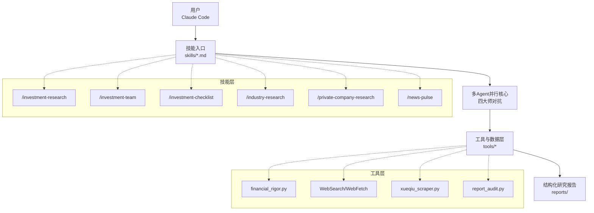
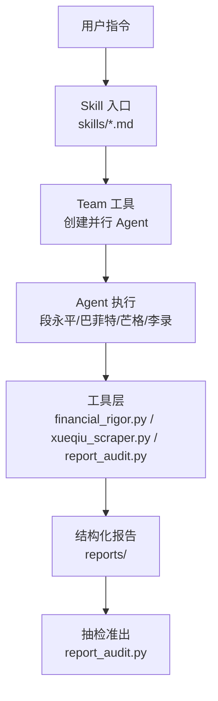
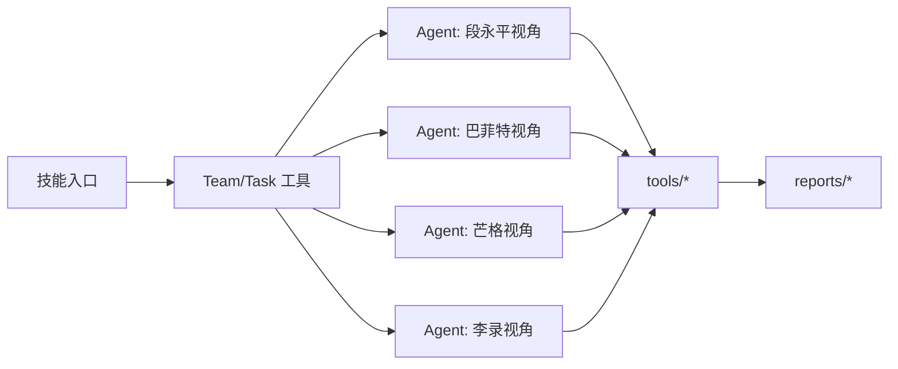

# 插件扩展机制

<cite>
**本文档引用的文件**
- [README.md](file://README.md)
- [CLAUDE.md](file://CLAUDE.md)
- [architecture.mmd](file://assets/architecture.mmd)
- [earnings-review.md](file://skills/earnings-review.md)
- [investment-team.md](file://skills/investment-team.md)
- [financial-data.md](file://skills/financial-data.md)
- [industry-research.md](file://skills/industry-research.md)
- [financial_rigor.py](file://tools/financial_rigor.py)
- [report_audit.py](file://tools/report_audit.py)
- [stock_screener.py](file://tools/stock_screener.py)
- [momentum_backtest.py](file://tools/momentum_backtest.py)
- [xueqiu_scraper.py](file://tools/xueqiu_scraper.py)
- [log-command.sh](file://tools/log-command.sh)
</cite>

## 目录
1. [简介](#简介)
2. [项目结构](#项目结构)
3. [核心组件](#核心组件)
4. [架构概览](#架构概览)
5. [详细组件分析](#详细组件分析)
6. [依赖分析](#依赖分析)
7. [性能考虑](#性能考虑)
8. [故障排查指南](#故障排查指南)
9. [结论](#结论)
10. [附录](#附录)

## 简介
本文件系统化阐述 AI Berkshire 的插件扩展机制，围绕技能系统（Skills）、工具函数（Tools）与第三方组件集成展开，覆盖插件生命周期管理、配置参数传递、错误处理与性能监控策略，并提供自定义分析场景的开发模板、调试技巧、测试方法与部署流程。

## 项目结构
AI Berkshire 采用“技能入口 + 多Agent并行核心 + 工具与数据层”的三层设计，通过 Claude Code 的 Skill 机制将用户指令路由到具体技能，技能内部组织多Agent并行执行，工具层提供精确计算、数据抓取与报告抽检等能力，最终输出标准化研究报告。

图表来源
- [CLAUDE.md:10-15](file://CLAUDE.md#L10-L15)
- [README.md:154-166](file://README.md#L154-L166)
- [architecture.mmd:1-39](file://assets/architecture.mmd#L1-L39)

章节来源
- [CLAUDE.md:10-15](file://CLAUDE.md#L10-L15)
- [README.md:154-166](file://README.md#L154-L166)
- [architecture.mmd:1-39](file://assets/architecture.mmd#L1-L39)

## 核心组件
- 技能系统（Skills）
  - 以 .md 文件形式定义，复制到 Claude Code 的 commands 目录后即可调用。
  - 提供 16 个技能，涵盖深度研究、财报分析、行业筛选、持仓管理与思维工具。
- 多Agent并行核心
  - 投研团队技能将四类角色（段永平/巴菲特/芒格/李录视角）并行执行，Team Lead 汇总研判。
- 工具与数据层
  - 精确计算与交叉验证（financial_rigor.py）
  - 报告抽检与准出（report_audit.py）
  - 数据抓取（xueqiu_scraper.py）
  - 选股筛（stock_screener.py、momentum_backtest.py）
- 输出与归档
  - 结构化研究报告统一写入 reports/ 目录，按公司/主题分类存放。

章节来源
- [README.md:169-212](file://README.md#L169-L212)
- [investment-team.md:1-214](file://skills/investment-team.md#L1-L214)
- [financial_rigor.py:1-452](file://tools/financial_rigor.py#L1-L452)
- [report_audit.py:1-523](file://tools/report_audit.py#L1-L523)
- [xueqiu_scraper.py:1-434](file://tools/xueqiu_scraper.py#L1-L434)
- [stock_screener.py:1-402](file://tools/stock_screener.py#L1-L402)
- [momentum_backtest.py:1-361](file://tools/momentum_backtest.py#L1-L361)
- [CLAUDE.md:17-38](file://CLAUDE.md#L17-L38)

## 架构概览
整体架构强调“可扩展的技能入口 + 可复用的工具函数 + 可审计的报告流程”。技能通过 Claude Code 的 Task/Team 工具调度 Agent，Agent 通过 WebSearch/WebFetch 获取数据，借助 tools 完成精确计算与交叉验证，最终由 report_audit.py 进行抽检准出。

图表来源
- [investment-team.md:34-214](file://skills/investment-team.md#L34-L214)
- [financial_rigor.py:1-452](file://tools/financial_rigor.py#L1-L452)
- [report_audit.py:1-523](file://tools/report_audit.py#L1-L523)
- [xueqiu_scraper.py:1-434](file://tools/xueqiu_scraper.py#L1-L434)

章节来源
- [README.md:154-166](file://README.md#L154-L166)
- [investment-team.md:5-214](file://skills/investment-team.md#L5-L214)
- [architecture.mmd:1-39](file://assets/architecture.mmd#L1-L39)

## 详细组件分析

### 技能系统扩展方法
- 技能定义与安装
  - 将 skills/*.md 复制到 Claude Code 的全局 commands 目录，即可通过 /命令名 方式调用。
  - 技能内部可使用 Team/Task 工具创建并行 Agent，实现多视角对抗分析。
- 执行流程与数据传递
  - 技能通过 $ARGUMENTS 接收输入（如公司名、季度、主题等），并在内部组织 Agent 并行执行。
  - Agent 间通过 SendMessage 进行消息通信，最终由 Team Lead 汇总输出。
- 输出规范
  - 报告统一写入 reports/ 目录，遵循 Markdown 表格与结构化要点，便于抽检与复现。

章节来源
- [README.md:214-264](file://README.md#L214-L264)
- [investment-team.md:3-214](file://skills/investment-team.md#L3-L214)
- [CLAUDE.md:17-38](file://CLAUDE.md#L17-L38)

### 工具函数开发规范
- 精确计算与交叉验证
  - financial_rigor.py 提供市值验算、估值指标验算、多源交叉验证、Benford定律检测、精确计算器与三情景估值等命令。
  - 所有计算使用 decimal.Decimal，避免浮点误差；支持容差阈值控制。
- 报告抽检与准出
  - report_audit.py 从报告中抽取 15% 随机样本，与可靠信源比对，输出准出/打回判决。
  - 支持固定随机种子复现实验，便于回归与审计。
- 数据抓取与缓存
  - xueqiu_scraper.py 提供雪球用户时间线爬取，支持登录态复用、断点续爬、反限流与纯转发过滤。
- 选股筛与回测
  - stock_screener.py 提供动量发现 + 价值验证的扫描与信号分级；momentum_backtest.py 提供历史回测验证。

章节来源
- [financial_rigor.py:1-452](file://tools/financial_rigor.py#L1-L452)
- [report_audit.py:1-523](file://tools/report_audit.py#L1-L523)
- [xueqiu_scraper.py:1-434](file://tools/xueqiu_scraper.py#L1-L434)
- [stock_screener.py:1-402](file://tools/stock_screener.py#L1-L402)
- [momentum_backtest.py:1-361](file://tools/momentum_backtest.py#L1-L361)

### 第三方组件集成方式
- WebSearch/WebFetch
  - 技能通过 Claude Code 的 WebSearch/WebFetch 工具实时检索信息，确保数据新鲜度。
- 外部API与数据源
  - Yahoo Finance Chart API（stock_screener.py、momentum_backtest.py）
  - 雪球 API（xueqiu_scraper.py）
  - Morningstar 筛选器 API（morningstar_fair_value.py）
- 登录态与持久化
  - xueqiu_scraper.py 支持 Playwright 登录态复用与断点续爬，避免重复登录与限流影响。

章节来源
- [investment-team.md:104-128](file://skills/investment-team.md#L104-L128)
- [stock_screener.py:19-78](file://tools/stock_screener.py#L19-L78)
- [momentum_backtest.py:19-48](file://tools/momentum_backtest.py#L19-L48)
- [xueqiu_scraper.py:103-191](file://tools/xueqiu_scraper.py#L103-L191)

### 插件生命周期管理
- 生命周期阶段
  - 初始化：技能加载、参数解析、Agent 创建与启动。
  - 执行：并行 Agent 搜索、交叉验证、数据整合。
  - 输出：生成结构化报告，写入 reports/。
  - 质检：report_audit.py 抽检，输出准出/打回。
  - 清理：TeamDelete 清理资源，释放内存与网络连接。
- 参数传递
  - 技能通过 $ARGUMENTS 接收输入，工具通过命令行参数或 JSON 模板传递配置。
  - Agent 间通过 SendMessage 传递分析结果与进度。
- 错误处理
  - 网络请求设置超时与重试；工具层对异常进行捕获与降级提示。
  - 报告抽检失败时输出详细原因，支持修正后重审。

章节来源
- [investment-team.md:34-214](file://skills/investment-team.md#L34-L214)
- [report_audit.py:405-523](file://tools/report_audit.py#L405-L523)

### 配置参数传递
- 技能参数
  - 通过 /技能名 参数传入（如公司名、季度、主题），技能内部解析并驱动 Agent。
- 工具参数
  - financial_rigor.py：verify-market-cap、verify-valuation、cross-validate、benford、calc、three-scenario 等子命令。
  - report_audit.py：extract（抽样比例、种子）、verdict（核验结果 JSON）。
  - xueqiu_scraper.py：--user-id、--keywords、--output、--state-path、--dump-all、--from-cache。
  - stock_screener.py：默认扫描 watchlist，或指定标的；--update 更新基本面数据。
- 环境变量
  - xueqiu_scraper.py 使用 XQ_PHONE、XQ_PASSWORD 注入登录凭据。

章节来源
- [earnings-review.md:1-219](file://skills/earnings-review.md#L1-L219)
- [financial_rigor.py:367-452](file://tools/financial_rigor.py#L367-L452)
- [report_audit.py:405-523](file://tools/report_audit.py#L405-L523)
- [xueqiu_scraper.py:13-29](file://tools/xueqiu_scraper.py#L13-L29)
- [stock_screener.py:332-402](file://tools/stock_screener.py#L332-L402)

### 错误处理机制
- 网络与限流
  - xueqiu_scraper.py：2-4s 随机抖动、每 50 页长休 30s、连续 5 次超时自动保存进度并退出。
  - stock_screener.py：curl 超时控制与数据长度校验。
- 数据一致性
  - financial_rigor.py：多源交叉验证容差阈值（默认 2%），超过阈值标记差异并提示原始财报校验。
  - report_audit.py：1% 容差，不通过项详细列出偏差与原文位置。
- 报告抽检
  - report_audit.py：支持两来源交叉验证，输出警告项并提示人工复核。

章节来源
- [xueqiu_scraper.py:271-321](file://tools/xueqiu_scraper.py#L271-L321)
- [stock_screener.py:56-78](file://tools/stock_screener.py#L56-L78)
- [financial_rigor.py:167-204](file://tools/financial_rigor.py#L167-L204)
- [report_audit.py:243-398](file://tools/report_audit.py#L243-L398)

### 性能监控策略
- 日志与统计
  - log-command.sh 记录用户指令到 JSONL 日志，支持计数提醒与背景摘要补充。
- 报告抽检
  - report_audit.py 抽样 15%，兼顾效率与覆盖率；支持固定种子复现实验。
- 回测与验证
  - momentum_backtest.py 对历史回测验证框架有效性，输出首次买入信号与总回报。

章节来源
- [log-command.sh:1-39](file://tools/log-command.sh#L1-L39)
- [report_audit.py:229-237](file://tools/report_audit.py#L229-L237)
- [momentum_backtest.py:207-324](file://tools/momentum_backtest.py#L207-L324)

### 自定义分析场景开发模板
- 场景一：财报精读
  - 输入：公司名 + 期间（季度/年报/最新）
  - 步骤：资料可得性评级 → 获取原始资料 → 核心财务数据提取与验证 → 管理层讨论精读 → 附注与隐藏信息挖掘 → 历史对比 → 输出报告 → 数据抽检
  - 关键工具：financial_rigor.py、report_audit.py
- 场景二：多Agent投研团队
  - 输入：公司名
  - 步骤：展示团队框架 → AI研究偏见评估 → 创建团队 → 四个任务并行启动 → 接收报告并跟踪进度 → 汇总最终报告 → 保存报告 → 数据抽检 → 清理团队
  - 关键工具：Team/Task 工具、financial_rigor.py、report_audit.py
- 场景三：行业研究
  - 输入：行业主题
  - 步骤：逻辑链构建与验证 → 产业链全景图 → 全球上市公司扫描 → 头部公司四大师分析 → 行业级风险评估 → 文明趋势判断 → 投资组合配置建议 → 综合决策备忘录 → 数据抽检
  - 关键工具：WebSearch、financial_rigor.py、report_audit.py
- 场景四：数据抓取与观点聚合
  - 输入：雪球用户ID + 关键词
  - 步骤：登录态复用 → 遍历时间线 → 关键词过滤 → 输出 Markdown
  - 关键工具：xueqiu_scraper.py

章节来源
- [earnings-review.md:22-219](file://skills/earnings-review.md#L22-L219)
- [investment-team.md:5-214](file://skills/investment-team.md#L5-L214)
- [industry-research.md:1-269](file://skills/industry-research.md#L1-L269)
- [xueqiu_scraper.py:18-434](file://tools/xueqiu_scraper.py#L18-L434)

### 调试技巧
- 技能调试
  - 使用 dry-run 模式（report_audit.py extract --dry-run）预览抽检清单，不发起网络请求。
  - 固定随机种子（report_audit.py extract --seed 42）复现实验样本。
- 工具调试
  - financial_rigor.py 子命令按需单独执行，快速验证关键指标。
  - xueqiu_scraper.py 使用 --from-cache 模式从已有全量缓存过滤生成报告，节省网络与时间。
- 日志与追踪
  - log-command.sh 自动记录用户指令，便于回溯与审计。

章节来源
- [report_audit.py:424-432](file://tools/report_audit.py#L424-L432)
- [xueqiu_scraper.py:368-395](file://tools/xueqiu_scraper.py#L368-L395)
- [log-command.sh:1-39](file://tools/log-command.sh#L1-L39)

### 测试方法
- 单元级测试
  - financial_rigor.py：对 verify-market-cap、verify-valuation、cross-validate、benford、calc、three-scenario 进行参数与边界测试。
  - report_audit.py：对 extract 与 verdict 的输入输出进行 JSON 结构与容差测试。
- 端到端测试
  - 投研团队技能：模拟并行 Agent 执行，验证进度跟踪与最终报告结构。
  - 行业研究技能：验证逻辑链、产业链扫描与头部公司分析的完整性。
- 回测验证
  - momentum_backtest.py：对 NVDA/AMD/MU 的历史回测，验证动量发现与价值验证的有效性。

章节来源
- [financial_rigor.py:367-452](file://tools/financial_rigor.py#L367-L452)
- [report_audit.py:405-523](file://tools/report_audit.py#L405-L523)
- [momentum_backtest.py:331-361](file://tools/momentum_backtest.py#L331-L361)

### 部署流程
- 安装与配置
  - 安装 Claude Code，复制 skills/*.md 到 ~/.claude/commands/。
  - 安装 Python 依赖（tools 使用 Python 标准库，无需额外依赖）。
- 运行与发布
  - 调用技能生成报告，使用 report_audit.py 进行抽检，通过后发布。
  - 报告统一存放于 reports/ 目录，按公司/主题分类。

章节来源
- [README.md:214-264](file://README.md#L214-L264)
- [CLAUDE.md:17-38](file://CLAUDE.md#L17-L38)

## 依赖分析
- 技能与工具耦合
  - 技能通过 Bash 调用 tools/* 子命令，形成“技能层 → 工具层”的调用关系。
- Agent 与工具协作
  - 技能内部 Team/Task 工具创建 Agent，Agent 通过 WebSearch 获取数据，借助 financial_rigor.py 完成精确计算与交叉验证。
- 数据流
  - WebSearch → Agent → tools（精确计算/交叉验证/抽检）→ 报告 → 抽检准出。

图表来源
- [investment-team.md:34-214](file://skills/investment-team.md#L34-L214)
- [financial_rigor.py:1-452](file://tools/financial_rigor.py#L1-L452)
- [report_audit.py:1-523](file://tools/report_audit.py#L1-L523)

章节来源
- [investment-team.md:34-214](file://skills/investment-team.md#L34-L214)

## 性能考虑
- 并行执行
  - 投研团队技能通过 Task 工具并行启动 Agent，缩短总耗时。
- 数据抓取与缓存
  - xueqiu_scraper.py 断点续爬与全量缓存，减少重复抓取。
- 抽检采样
  - report_audit.py 15% 随机抽样，兼顾效率与质量。
- 精确计算
  - financial_rigor.py 使用 decimal.Decimal，避免浮点误差累积。

## 故障排查指南
- 网络请求失败
  - 检查超时设置与重试策略；必要时更换数据源或使用备用接口。
- 数据差异过大
  - 使用 financial_rigor.py cross-validate 对比多源数据，超过阈值需核查原始财报。
- 报告抽检不通过
  - 查看 report_audit.py 输出的偏差明细与原文位置，修正后重审。
- 登录态失效
  - xueqiu_scraper.py 删除旧 state 文件后重新登录，或使用环境变量注入凭据。

章节来源
- [xueqiu_scraper.py:111-191](file://tools/xueqiu_scraper.py#L111-L191)
- [financial_rigor.py:167-204](file://tools/financial_rigor.py#L167-L204)
- [report_audit.py:253-398](file://tools/report_audit.py#L253-L398)

## 结论
AI Berkshire 的插件扩展机制通过“技能入口 + 多Agent并行 + 工具层”实现了可扩展、可复现、可审计的投资研究框架。开发者可基于现有技能模板与工具函数快速开发自定义分析场景，结合严格的错误处理与性能监控策略，确保输出质量与稳定性。

## 附录
- 开发最佳实践
  - 保持技能职责单一，参数清晰；优先使用 tools/* 完成精确计算与交叉验证。
  - 报告结构化、数据可追溯，严格遵循抽检流程。
  - 使用断点续爬与缓存策略提升数据抓取效率。
- 代码示例路径
  - 精确计算：[financial_rigor.py:367-452](file://tools/financial_rigor.py#L367-L452)
  - 报告抽检：[report_audit.py:405-523](file://tools/report_audit.py#L405-L523)
  - 数据抓取：[xueqiu_scraper.py:377-434](file://tools/xueqiu_scraper.py#L377-L434)
  - 选股筛：[stock_screener.py:332-402](file://tools/stock_screener.py#L332-L402)
  - 回测验证：[momentum_backtest.py:331-361](file://tools/momentum_backtest.py#L331-L361)