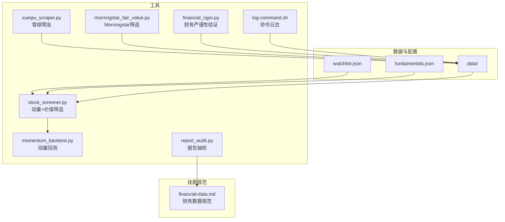
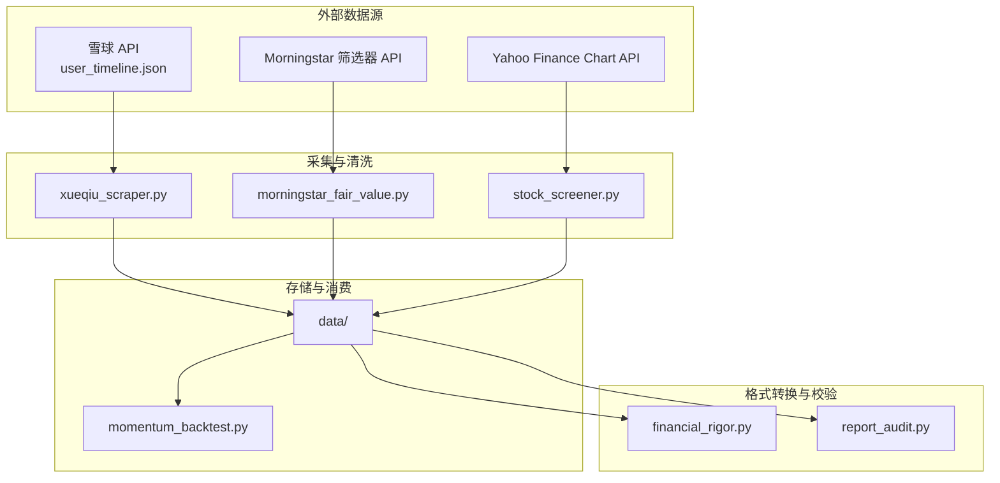
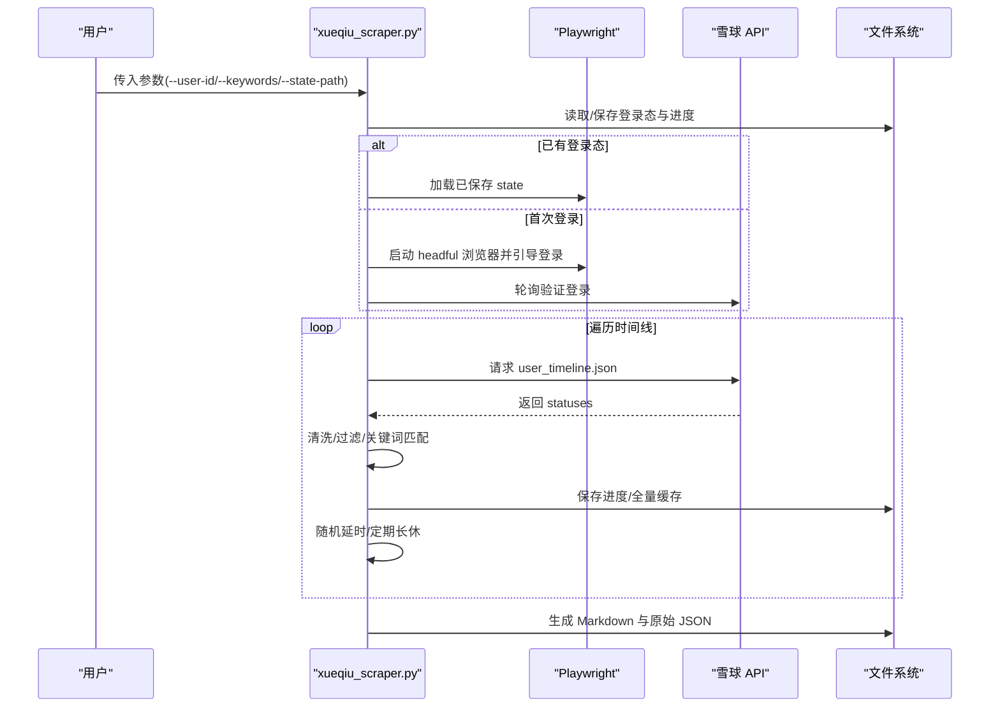
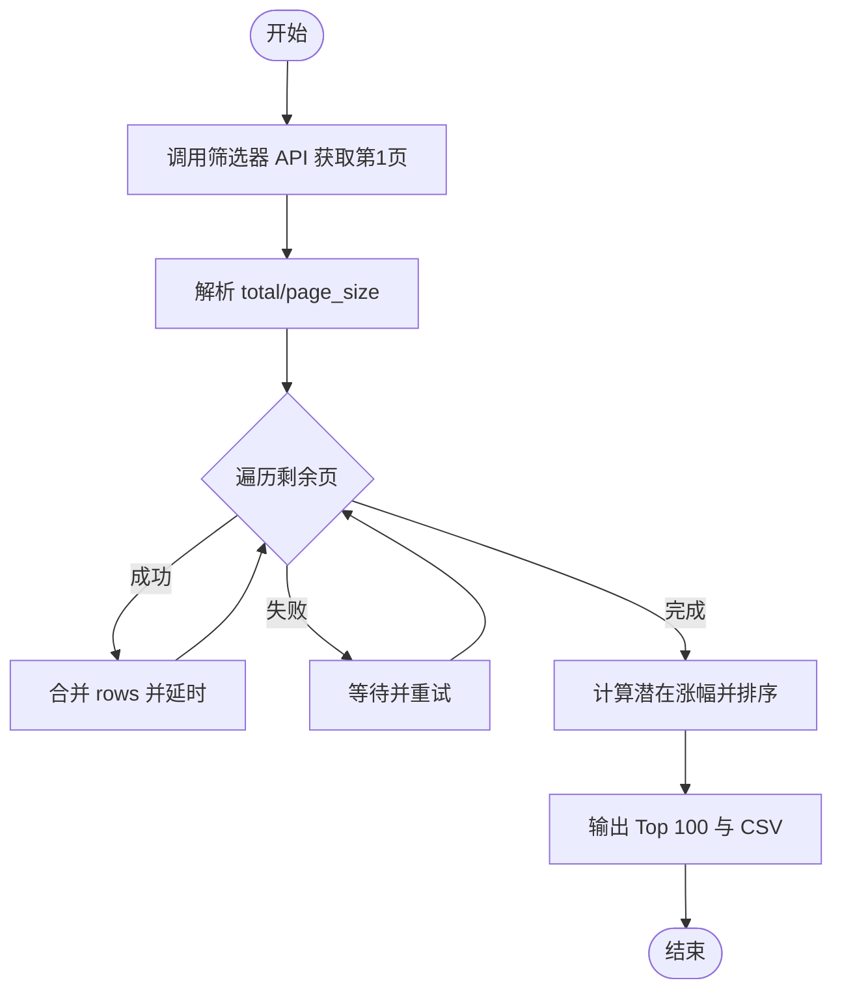
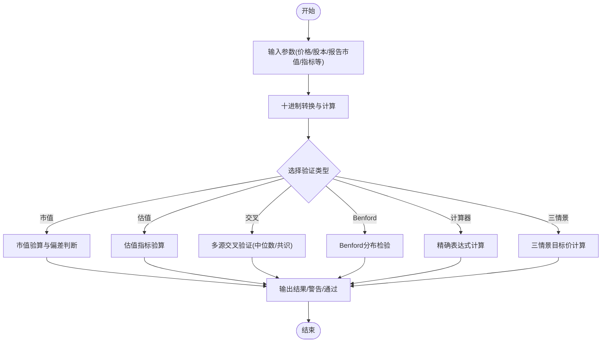
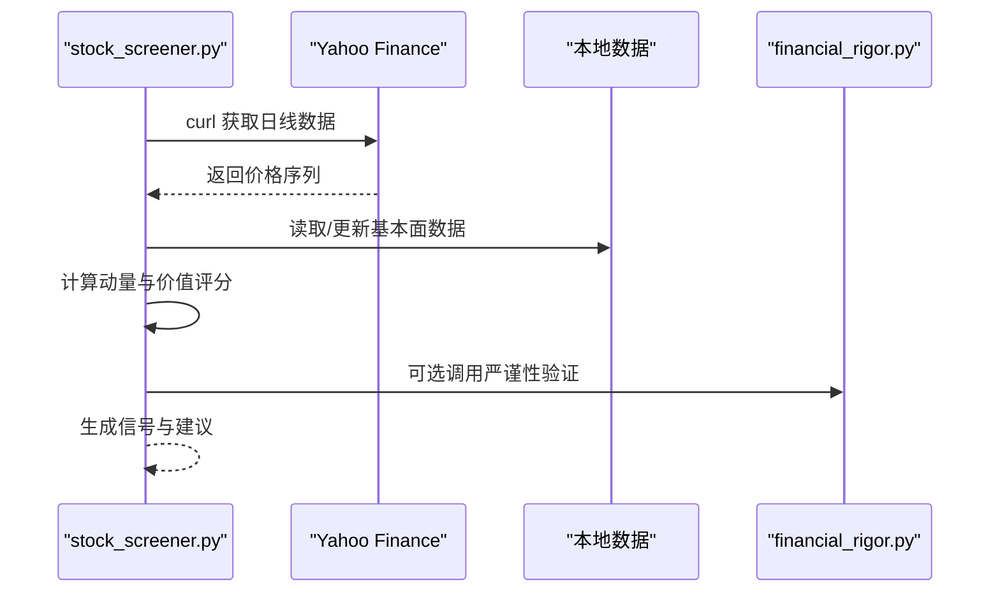
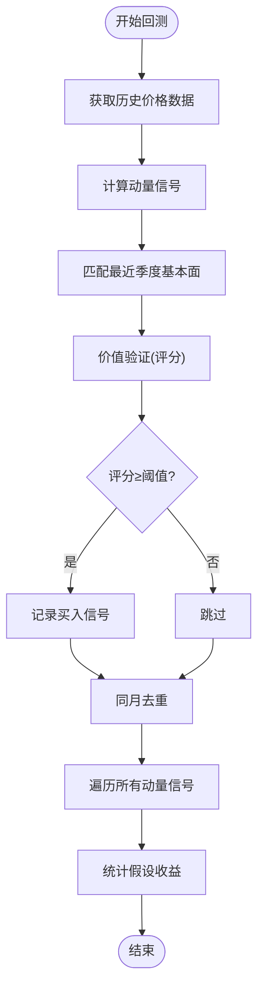
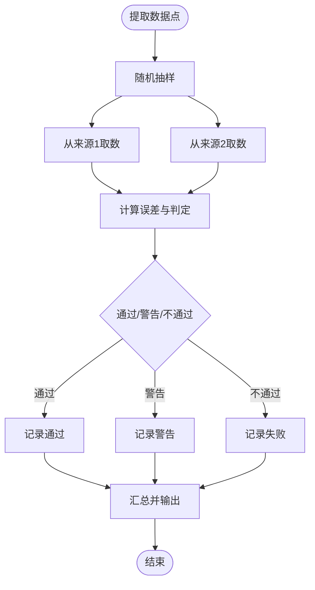
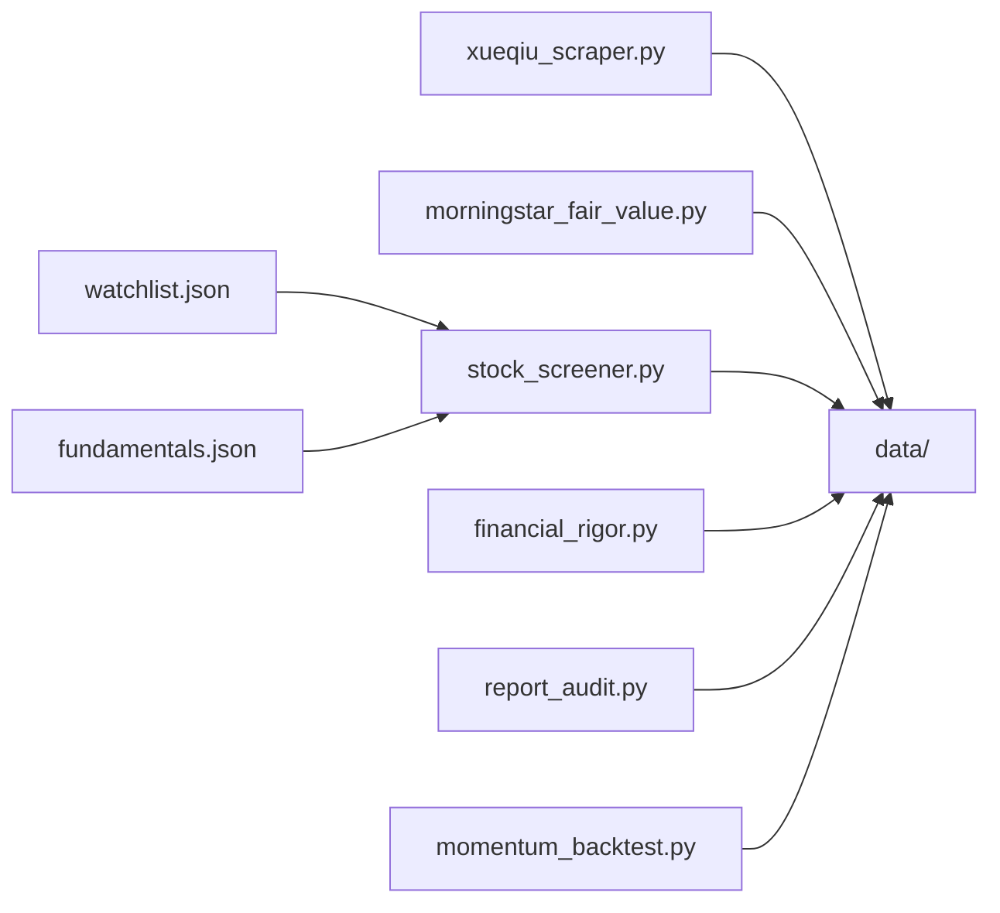

# 第三方数据源集成

<cite>
**本文引用的文件**
- [xueqiu_scraper.py](file://tools/xueqiu_scraper.py)
- [financial_rigor.py](file://tools/financial_rigor.py)
- [morningstar_fair_value.py](file://tools/morningstar_fair_value.py)
- [stock_screener.py](file://tools/stock_screener.py)
- [momentum_backtest.py](file://tools/momentum_backtest.py)
- [report_audit.py](file://tools/report_audit.py)
- [log-command.sh](file://tools/log-command.sh)
- [watchlist.json](file://data/watchlist.json)
- [fundamentals.json](file://data/fundamentals.json)
- [financial-data.md](file://skills/financial-data.md)
</cite>

## 目录
1. [简介](#简介)
2. [项目结构](#项目结构)
3. [核心组件](#核心组件)
4. [架构总览](#架构总览)
5. [详细组件分析](#详细组件分析)
6. [依赖关系分析](#依赖关系分析)
7. [性能考量](#性能考量)
8. [故障排除指南](#故障排除指南)
9. [结论](#结论)
10. [附录](#附录)

## 简介
本文件面向“第三方数据源集成”的技术文档，围绕以下目标展开：
- 数据源集成架构：API接口封装、数据格式转换、错误处理与重试机制
- 雪球爬虫实现原理：反爬虫策略应对、数据提取算法、缓存机制设计
- 财务严谨性验证：数据来源、精确十进制计算、数据校验规则与异常处理流程
- 配置管理、认证机制、速率限制处理与数据同步策略
- 新数据源接入指南、性能优化技巧与故障排除方法

## 项目结构
该项目以工具脚本为核心，围绕“数据采集—清洗—验证—回测—审计”闭环组织，数据与配置位于 data 目录，工具位于 tools 目录，技能规范位于 skills 目录。

图表来源
- [watchlist.json:1-38](file://data/watchlist.json#L1-L38)
- [fundamentals.json:1-36](file://data/fundamentals.json#L1-L36)
- [xueqiu_scraper.py:1-434](file://tools/xueqiu_scraper.py#L1-L434)
- [morningstar_fair_value.py:1-153](file://tools/morningstar_fair_value.py#L1-L153)
- [financial_rigor.py:1-452](file://tools/financial_rigor.py#L1-L452)
- [stock_screener.py:1-402](file://tools/stock_screener.py#L1-L402)
- [momentum_backtest.py:1-361](file://tools/momentum_backtest.py#L1-L361)
- [report_audit.py:261-479](file://tools/report_audit.py#L261-L479)
- [log-command.sh:1-40](file://tools/log-command.sh#L1-L40)
- [financial-data.md:1-44](file://skills/financial-data.md#L1-L44)

章节来源
- [watchlist.json:1-38](file://data/watchlist.json#L1-L38)
- [fundamentals.json:1-36](file://data/fundamentals.json#L1-L36)

## 核心组件
- 雪球爬虫：基于 Playwright 的异步抓取，支持登录态复用、双通道请求、断点续爬、反限流与纯转发过滤。
- Morningstar 公允价值筛选：通过 curl 调用筛选器 API，批量抓取并计算潜在涨幅，输出 Top 100。
- 财务严谨性验证：提供市值/估值/交叉验证/Benford 检查/精确计算器/三情景估值等模块，统一使用十进制避免浮点误差。
- 动量+价值筛选：从 Yahoo Finance 获取价格数据，结合本地基本面数据进行评分与信号分级。
- 动量回测：对 NVDA/AMD/MU 历史回测，验证框架在 AI 早期阶段的捕捉能力。
- 报告抽检：对研究文本中的关键数据点进行多源交叉验证与误差判定。
- 日志与审计：命令日志记录与抽检流程规范，确保可追溯与可复核。

章节来源
- [xueqiu_scraper.py:1-434](file://tools/xueqiu_scraper.py#L1-L434)
- [morningstar_fair_value.py:1-153](file://tools/morningstar_fair_value.py#L1-L153)
- [financial_rigor.py:1-452](file://tools/financial_rigor.py#L1-L452)
- [stock_screener.py:1-402](file://tools/stock_screener.py#L1-L402)
- [momentum_backtest.py:1-361](file://tools/momentum_backtest.py#L1-L361)
- [report_audit.py:261-479](file://tools/report_audit.py#L261-L479)
- [log-command.sh:1-40](file://tools/log-command.sh#L1-L40)

## 架构总览
下图展示了数据源集成的整体架构：外部数据源（雪球、Morningstar、Yahoo Finance）通过工具脚本进行采集与清洗，中间层进行格式转换与一致性校验，最终输出到 data 目录并被上层筛选/回测/审计模块消费。

图表来源
- [xueqiu_scraper.py:62-100](file://tools/xueqiu_scraper.py#L62-L100)
- [morningstar_fair_value.py:31-37](file://tools/morningstar_fair_value.py#L31-L37)
- [stock_screener.py:48-77](file://tools/stock_screener.py#L48-L77)
- [financial_rigor.py:61-92](file://tools/financial_rigor.py#L61-L92)
- [report_audit.py:261-398](file://tools/report_audit.py#L261-L398)
- [momentum_backtest.py:19-47](file://tools/momentum_backtest.py#L19-L47)

## 详细组件分析

### 雪球爬虫：API封装、反爬虫与缓存
- 登录态复用与交互式登录：支持从环境变量注入凭据，或在 headful 浏览器中手动登录，并持久化 state 至本地文件，后续可直接复用。
- 双通道请求：优先使用页面内 fetch，失败则回退到上下文级 request，提升稳定性。
- 断点续爬：以进度文件记录下一页与已采集条目，中断后可自动续爬。
- 反限流策略：随机抖动（2-4s）、每 50 页长休 30s、连续 5 次超时自动退出以保护进度。
- 数据提取与过滤：清理 HTML 实体、解析时间戳、仅收录“本人原发言”，并支持关键词过滤与全量缓存。
- 输出：生成 Markdown 文档与原始 JSON，便于二次分析。

图表来源
- [xueqiu_scraper.py:111-151](file://tools/xueqiu_scraper.py#L111-L151)
- [xueqiu_scraper.py:194-321](file://tools/xueqiu_scraper.py#L194-L321)
- [xueqiu_scraper.py:377-430](file://tools/xueqiu_scraper.py#L377-L430)

章节来源
- [xueqiu_scraper.py:1-434](file://tools/xueqiu_scraper.py#L1-L434)

### Morningstar 公允价值筛选：API封装与数据转换
- 使用 curl 调用筛选器 API，分页抓取有公允价值估计的股票。
- 解析返回字段，提取 ticker、名称、收盘价、公允价值、星级、护城河等。
- 计算潜在涨幅并排序，输出 Top 100，同时保存完整 CSV。

图表来源
- [morningstar_fair_value.py:31-74](file://tools/morningstar_fair_value.py#L31-L74)
- [morningstar_fair_value.py:77-135](file://tools/morningstar_fair_value.py#L77-L135)

章节来源
- [morningstar_fair_value.py:1-153](file://tools/morningstar_fair_value.py#L1-L153)

### 财务严谨性验证：精确十进制与多源交叉
- 市值验算：股价×总股本与报告市值对比，偏差阈值控制。
- 估值指标验算：PE/PB/P/FCF/PS/股息率等，统一使用十进制避免浮点误差。
- 多源交叉验证：对同一指标在多个来源进行比较，给出中位数共识与偏差。
- Benford 定律检测：对财务数据首数字分布进行统计检验，辅助识别异常。
- 精确计算器：安全表达式求值，支持科学计数法。
- 三情景估值：基于不同增长与PE情景计算目标价与涨跌幅。

图表来源
- [financial_rigor.py:61-92](file://tools/financial_rigor.py#L61-L92)
- [financial_rigor.py:98-160](file://tools/financial_rigor.py#L98-L160)
- [financial_rigor.py:167-204](file://tools/financial_rigor.py#L167-L204)
- [financial_rigor.py:214-281](file://tools/financial_rigor.py#L214-L281)
- [financial_rigor.py:288-313](file://tools/financial_rigor.py#L288-L313)
- [financial_rigor.py:320-361](file://tools/financial_rigor.py#L320-L361)

章节来源
- [financial_rigor.py:1-452](file://tools/financial_rigor.py#L1-L452)

### 动量+价值筛选：数据获取与评分
- 价格数据：通过 curl 调用 Yahoo Finance Chart API 获取日线数据。
- 基本面数据：本地 fundamentals.json，支持交互式更新。
- 动量发现：60日新高+放量确认；价值验证：6维评分（含毛利率连续改善、EPS超预期等改进项）。
- 信号分级：根据评分与独立条件给出买入等级与建议仓位。

图表来源
- [stock_screener.py:48-77](file://tools/stock_screener.py#L48-L77)
- [stock_screener.py:84-116](file://tools/stock_screener.py#L84-L116)
- [stock_screener.py:122-161](file://tools/stock_screener.py#L122-L161)
- [stock_screener.py:167-249](file://tools/stock_screener.py#L167-L249)
- [stock_screener.py:256-277](file://tools/stock_screener.py#L256-L277)

章节来源
- [stock_screener.py:1-402](file://tools/stock_screener.py#L1-L402)
- [watchlist.json:1-38](file://data/watchlist.json#L1-L38)
- [fundamentals.json:1-36](file://data/fundamentals.json#L1-L36)

### 动量回测：历史信号验证
- 历史价格：通过 Yahoo Finance API 获取指定时间范围内的日线数据。
- 基本面数据：内置 NVDA/AMD/MU 的季度财务数据，手工录入保证准确性。
- 回测流程：计算动量信号→匹配最近季度→价值验证→统计假设收益。

图表来源
- [momentum_backtest.py:19-47](file://tools/momentum_backtest.py#L19-L47)
- [momentum_backtest.py:112-145](file://tools/momentum_backtest.py#L112-L145)
- [momentum_backtest.py:152-201](file://tools/momentum_backtest.py#L152-L201)
- [momentum_backtest.py:207-324](file://tools/momentum_backtest.py#L207-L324)

章节来源
- [momentum_backtest.py:1-361](file://tools/momentum_backtest.py#L1-L361)

### 报告抽检：多源交叉与误差判定
- 从研究文本中抽取关键数据点，随机抽样并输出抽检清单。
- 从可靠来源取数，计算误差并判定通过/警告/不通过。
- 输出抽检结论与失败项明细，支持人工复核。

图表来源
- [report_audit.py:261-398](file://tools/report_audit.py#L261-L398)
- [report_audit.py:405-479](file://tools/report_audit.py#L405-L479)
- [financial-data.md:1-44](file://skills/financial-data.md#L1-L44)

章节来源
- [report_audit.py:261-479](file://tools/report_audit.py#L261-L479)
- [financial-data.md:1-44](file://skills/financial-data.md#L1-L44)

## 依赖关系分析
- 工具间耦合：stock_screener.py 依赖 data/watchlist.json 与 data/fundamentals.json；financial_rigor.py 与 report_audit.py 依赖 data/ 输出；xueqiu_scraper.py 与 morningstar_fair_value.py 产出 data/ 文件供其他模块消费。
- 外部依赖：Playwright（异步浏览器）、curl（HTTP 请求）、Python 标准库（decimal、json、subprocess、urllib 等）。
- 配置与认证：雪球爬虫通过环境变量注入凭据，支持登录态持久化；其他工具无外部认证要求。

图表来源
- [xueqiu_scraper.py:1-434](file://tools/xueqiu_scraper.py#L1-L434)
- [morningstar_fair_value.py:1-153](file://tools/morningstar_fair_value.py#L1-L153)
- [stock_screener.py:1-402](file://tools/stock_screener.py#L1-L402)
- [financial_rigor.py:1-452](file://tools/financial_rigor.py#L1-L452)
- [report_audit.py:261-479](file://tools/report_audit.py#L261-L479)
- [momentum_backtest.py:1-361](file://tools/momentum_backtest.py#L1-L361)
- [watchlist.json:1-38](file://data/watchlist.json#L1-L38)
- [fundamentals.json:1-36](file://data/fundamentals.json#L1-L36)

章节来源
- [stock_screener.py:31-42](file://tools/stock_screener.py#L31-L42)
- [watchlist.json:1-38](file://data/watchlist.json#L1-L38)
- [fundamentals.json:1-36](file://data/fundamentals.json#L1-L36)

## 性能考量
- 异步与并发：Playwright 异步抓取与事件循环，降低阻塞；分页抓取时采用随机抖动与周期性长休，避免触发限流。
- 缓存与断点续爬：进度文件与全量缓存减少重复抓取；全量缓存支持离线多主题分析。
- 本地数据聚合：将价格与基本面数据集中存储，避免重复网络请求；回测使用内置数据，提高稳定性。
- 精确计算：十进制运算避免浮点误差，适合财务敏感场景；表达式安全评估防止注入风险。
- 输出与审计：CSV/JSON/Markdown 输出便于下游分析与审计；抽检流程确保关键数据一致性。

## 故障排除指南
- 雪球登录失败
  - 确认环境变量 XQ_PHONE 与 XQ_PASSWORD 设置正确；若未设置，使用 headful 浏览器手动登录并等待验证成功。
  - 若登录态过期，删除本地 state 文件后重新登录。
  - 章节来源
    - [xueqiu_scraper.py:111-151](file://tools/xueqiu_scraper.py#L111-L151)
    - [xueqiu_scraper.py:154-191](file://tools/xueqiu_scraper.py#L154-L191)

- 雪球抓取超时/限流
  - 自动重试与连续失败保护：连续 5 次超时自动保存进度并退出；每 50 页长休 30s。
  - 章节来源
    - [xueqiu_scraper.py:271-310](file://tools/xueqiu_scraper.py#L271-L310)

- Yahoo Finance 获取失败
  - curl 超时或返回码非 0：检查网络与代理；适当增加超时或重试次数。
  - 章节来源
    - [stock_screener.py:48-77](file://tools/stock_screener.py#L48-L77)

- Morningstar API 失败
  - 分页抓取时出现空页或异常：记录失败页并等待后重试；必要时降低并发。
  - 章节来源
    - [morningstar_fair_value.py:61-74](file://tools/morningstar_fair_value.py#L61-L74)

- 财务严谨性验证偏差过大
  - 检查单位一致性、汇率与 GAAP/Non-GAAP 差异；必要时采用更权威的一手数据源。
  - 章节来源
    - [financial_rigor.py:80-91](file://tools/financial_rigor.py#L80-L91)
    - [financial-data.md:1-44](file://skills/financial-data.md#L1-L44)

- 报告抽检误差超阈值
  - 两来源结果不一致：检查口径差异（GAAP/Non-GAAP、汇率、统计口径）；必要时人工复核。
  - 章节来源
    - [report_audit.py:315-345](file://tools/report_audit.py#L315-L345)

## 结论
本项目通过“工具化 + 规范化 + 审计化”的方式，构建了稳健的第三方数据源集成体系：
- 雪球爬虫具备完善的反爬虫与容错机制，支持断点续爬与全量缓存；
- Morningstar 筛选器 API 与 Yahoo Finance 数据采集形成互补；
- 财务严谨性验证模块以十进制计算确保财务数据的可审计性；
- 报告抽检与技能规范保障关键数据的一致性与可信度；
- 通过本地数据文件与清晰的依赖关系，实现高效的数据同步与消费。

## 附录

### 数据源配置管理与认证
- 雪球认证：通过环境变量注入手机号与密码；登录态持久化至本地文件，支持复用与续爬。
- 其他数据源：无需认证，使用 curl 或标准库 HTTP 客户端访问。
- 章节来源
  - [xueqiu_scraper.py:111-151](file://tools/xueqiu_scraper.py#L111-L151)
  - [xueqiu_scraper.py:154-191](file://tools/xueqiu_scraper.py#L154-L191)

### 速率限制处理
- 雪球：随机延时（2-4s）、每 50 页长休 30s、连续失败保护。
- Morningstar：分页抓取时短暂停顿（0.3s）。
- Yahoo Finance：curl 超时控制与错误重试。
- 章节来源
  - [xueqiu_scraper.py:306-310](file://tools/xueqiu_scraper.py#L306-L310)
  - [morningstar_fair_value.py:70-73](file://tools/morningstar_fair_value.py#L70-L73)
  - [stock_screener.py:57-60](file://tools/stock_screener.py#L57-L60)

### 数据同步策略
- 本地文件：watchlist.json 与 fundamentals.json 作为输入；各工具将结果写入 data/ 目录。
- 断点续爬：进度文件与全量缓存确保增量更新与离线分析。
- 章节来源
  - [watchlist.json:1-38](file://data/watchlist.json#L1-L38)
  - [fundamentals.json:1-36](file://data/fundamentals.json#L1-L36)
  - [xueqiu_scraper.py:263-270](file://tools/xueqiu_scraper.py#L263-L270)

### 新数据源接入指南
- 明确数据源接口与字段映射，参考现有工具的封装方式（curl/Playwright/标准库）。
- 设计数据格式转换函数，确保输出结构化数据（JSON/CSV）。
- 实现错误处理与重试逻辑，必要时引入断点续爬与缓存。
- 编写单元测试与抽检流程，确保数据一致性与可审计性。
- 章节来源
  - [stock_screener.py:48-77](file://tools/stock_screener.py#L48-L77)
  - [xueqiu_scraper.py:62-100](file://tools/xueqiu_scraper.py#L62-L100)
  - [financial_rigor.py:288-313](file://tools/financial_rigor.py#L288-L313)

### 性能优化技巧
- 使用异步 I/O 与合理的并发度，避免阻塞。
- 合理设置延时与重试策略，平衡吞吐与稳定性。
- 本地缓存与增量更新，减少重复抓取。
- 十进制计算与表达式安全评估，避免精度与安全问题。
- 章节来源
  - [xueqiu_scraper.py:271-310](file://tools/xueqiu_scraper.py#L271-L310)
  - [financial_rigor.py:288-313](file://tools/financial_rigor.py#L288-L313)