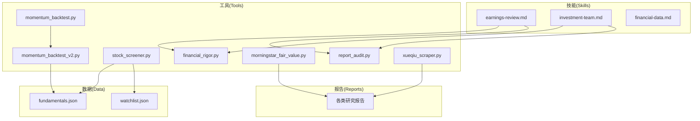
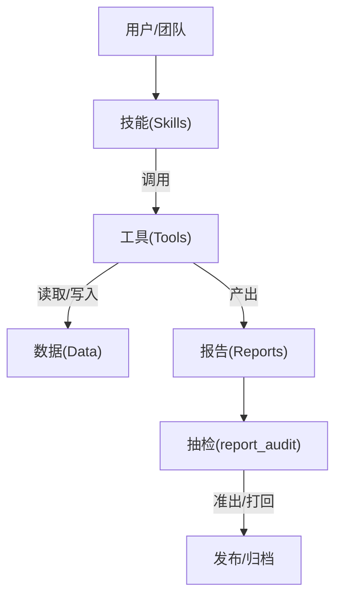
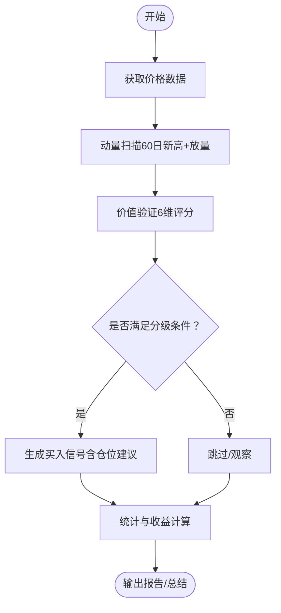
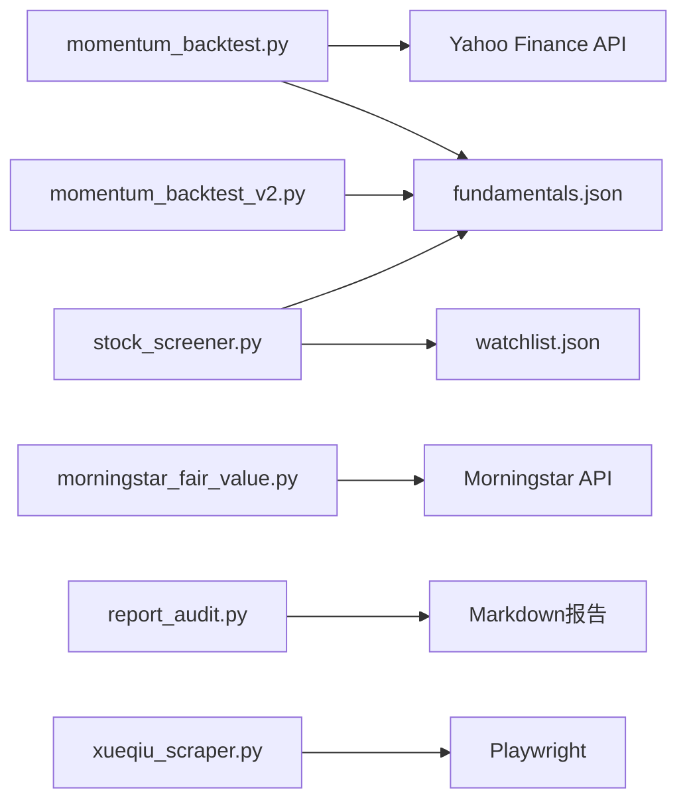

# 高级功能与扩展

<cite>
**本文引用的文件**   
- [tools/momentum_backtest.py](file://tools/momentum_backtest.py)
- [tools/momentum_backtest_v2.py](file://tools/momentum_backtest_v2.py)
- [tools/stock_screener.py](file://tools/stock_screener.py)
- [tools/financial_rigor.py](file://tools/financial_rigor.py)
- [tools/morningstar_fair_value.py](file://tools/morningstar_fair_value.py)
- [tools/report_audit.py](file://tools/report_audit.py)
- [tools/xueqiu_scraper.py](file://tools/xueqiu_scraper.py)
- [data/fundamentals.json](file://data/fundamentals.json)
- [data/watchlist.json](file://data/watchlist.json)
- [skills/earnings-review.md](file://skills/earnings-review.md)
- [skills/investment-team.md](file://skills/investment-team.md)
- [skills/financial-data.md](file://skills/financial-data.md)
- [CLAUDE.md](file://CLAUDE.md)
</cite>

## 目录
1. [简介](#简介)
2. [项目结构](#项目结构)
3. [核心组件](#核心组件)
4. [架构总览](#架构总览)
5. [详细组件分析](#详细组件分析)
6. [依赖关系分析](#依赖关系分析)
7. [性能考虑](#性能考虑)
8. [故障排除指南](#故障排除指南)
9. [结论](#结论)
10. [附录](#附录)

## 简介
本文件面向AI Berkshire的高级用户与扩展开发者，系统阐述“自定义分析场景”“插件系统扩展机制”“第三方数据源集成”“性能优化策略”，并深入解析“动量筛选器算法”“回测系统架构”“多因子模型构建方法”“实时数据获取技术方案”。文档同时提供API接口说明、配置选项、调试技巧与故障排除指南，并给出扩展开发最佳实践与代码示例路径。

## 项目结构
项目采用“技能（Skills）+工具（Tools）+数据（Data）+报告（Reports）+资源（Assets）”的分层组织方式：
- skills：定义投研流程与分析框架（如四大师视角、财报精读、团队并行分析）
- tools：提供回测、财务严谨性校验、数据抓取、报告抽检等工具
- data：基础数据（如基本面、自选股清单）
- reports：输出的研究报告与分析产物
- assets：图片与架构图等静态资源

图表来源
- [skills/earnings-review.md](file://skills/earnings-review.md)
- [skills/investment-team.md](file://skills/investment-team.md)
- [skills/financial-data.md](file://skills/financial-data.md)
- [tools/momentum_backtest.py](file://tools/momentum_backtest.py)
- [tools/momentum_backtest_v2.py](file://tools/momentum_backtest_v2.py)
- [tools/stock_screener.py](file://tools/stock_screener.py)
- [tools/financial_rigor.py](file://tools/financial_rigor.py)
- [tools/morningstar_fair_value.py](file://tools/morningstar_fair_value.py)
- [tools/report_audit.py](file://tools/report_audit.py)
- [tools/xueqiu_scraper.py](file://tools/xueqiu_scraper.py)
- [data/fundamentals.json](file://data/fundamentals.json)
- [data/watchlist.json](file://data/watchlist.json)

章节来源
- [CLAUDE.md: 项目结构与报告目录](file://CLAUDE.md)

## 核心组件
- 动量发现与价值验证回测系统：提供动量信号生成、价值验证评分、回测统计与可视化输出
- 选股筛（stock_screener）：基于动量与价值的信号分级，支持watchlist扫描与基本面数据交互式维护
- 财务严谨性工具（financial_rigor）：市值/估值/多源交叉验证/Benford检测/三情景估值/精确计算
- Morningstar公允价值筛选：抓取Fair Value Estimate并计算潜在涨幅Top 100
- 报告抽检（report_audit）：从Markdown报告中抽取样本，与权威信源比对，输出准出/打回
- 雪球爬虫（xueqiu_scraper）：Playwright登录态复用、断点续爬、关键词过滤、全量缓存
- 基础数据：fundamentals.json与watchlist.json

章节来源
- [tools/momentum_backtest.py](file://tools/momentum_backtest.py)
- [tools/momentum_backtest_v2.py](file://tools/momentum_backtest_v2.py)
- [tools/stock_screener.py](file://tools/stock_screener.py)
- [tools/financial_rigor.py](file://tools/financial_rigor.py)
- [tools/morningstar_fair_value.py](file://tools/morningstar_fair_value.py)
- [tools/report_audit.py](file://tools/report_audit.py)
- [tools/xueqiu_scraper.py](file://tools/xueqiu_scraper.py)
- [data/fundamentals.json](file://data/fundamentals.json)
- [data/watchlist.json](file://data/watchlist.json)

## 架构总览
整体架构遵循“技能驱动 + 工具链支撑 + 数据驱动”的闭环：
- 技能层：定义分析流程（如earnings-review、investment-team），约束数据来源与交叉验证
- 工具层：提供回测、财务校验、数据抓取、抽检等原子能力
- 数据层：本地JSON与外部API/网页，统一通过工具标准化
- 报告层：按规范生成最终报告，经抽检后发布

图表来源
- [skills/earnings-review.md](file://skills/earnings-review.md)
- [skills/investment-team.md](file://skills/investment-team.md)
- [tools/report_audit.py](file://tools/report_audit.py)
- [CLAUDE.md: 报告命名与目录规范](file://CLAUDE.md)

## 详细组件分析

### 动量筛选器与回测系统
- 动量发现引擎：基于60日新高突破与成交量放大（5日均量/20日均量>1.5或1.8阈值）识别潜在突破信号
- 价值验证引擎：6维/5维评分（营收增速改善、毛利率扩张/健康、EPS超预期、营收高增长、毛利率连续改善等），支持独立通过条件
- 回测主流程：数据获取→动量扫描→价值验证→信号汇总→收益计算→输出总结
- v2版本：引入“信号分级”（3/6试探仓、4/6标准仓、5-6/6确信仓），并针对NVDA/MU等案例优化阈值与独立条件

图表来源
- [tools/momentum_backtest.py](file://tools/momentum_backtest.py)
- [tools/momentum_backtest_v2.py](file://tools/momentum_backtest_v2.py)
- [tools/stock_screener.py](file://tools/stock_screener.py)

章节来源
- [tools/momentum_backtest.py](file://tools/momentum_backtest.py)
- [tools/momentum_backtest_v2.py](file://tools/momentum_backtest_v2.py)
- [tools/stock_screener.py](file://tools/stock_screener.py)

### 多因子模型构建方法
- 因子维度：营收同比增速改善、毛利率趋势、EPS超预期、营收高增长、毛利率健康、毛利率连续改善
- 评分机制：累计得分≥5或（≥4且独立通过）为确信仓；≥4或（≥3且独立通过）为标准仓；≥3为试探仓
- 独立通过条件：针对特定行业（如周期股）设置特殊阈值（如EPS超预期>30%）

章节来源
- [tools/stock_screener.py](file://tools/stock_screener.py)

### 实时数据获取技术方案
- Yahoo Finance：通过curl或urllib获取日线数据，支持超时控制与异常处理
- Morningstar：API分页抓取，提取公允价值估计并计算潜在涨幅
- 雪球：Playwright登录态复用，双通道fetch（页面JS fetch + APIRequestContext），断点续爬，随机抖动与长休防限流

章节来源
- [tools/momentum_backtest.py](file://tools/momentum_backtest.py)
- [tools/morningstar_fair_value.py](file://tools/morningstar_fair_value.py)
- [tools/xueqiu_scraper.py](file://tools/xueqiu_scraper.py)

### 财务严谨性与报告抽检
- 财务严谨性工具：市值验算、估值指标验算（PE/PB/PS/FCF Yield/ROE）、多源交叉验证、Benford定律检测、三情景估值、精确计算
- 报告抽检：从Markdown中抽取15%样本，与权威信源比对，输出准出/打回判决，支持第二来源交叉验证

章节来源
- [tools/financial_rigor.py](file://tools/financial_rigor.py)
- [tools/report_audit.py](file://tools/report_audit.py)
- [skills/financial-data.md](file://skills/financial-data.md)

### 插件系统扩展机制
- 技能（Skills）：以Markdown定义分析流程与约束，Claude Code Skills调用工具链完成自动化分析
- 工具（Tools）：以Python脚本形式提供原子能力，支持CLI参数化与模块化组合
- 数据（Data）：本地JSON文件（fundamentals.json、watchlist.json）作为输入，支持交互式更新
- 扩展建议：新增技能时，遵循“数据来源标注、交叉验证、明确结论”的原则；新增工具时，确保无外部依赖、健壮的异常处理与可重复的输出格式

章节来源
- [skills/earnings-review.md](file://skills/earnings-review.md)
- [skills/investment-team.md](file://skills/investment-team.md)
- [skills/financial-data.md](file://skills/financial-data.md)
- [CLAUDE.md: 报告命名与目录规范](file://CLAUDE.md)

## 依赖关系分析
- 动量回测依赖：价格数据（Yahoo Finance）、基本面数据（本地JSON）
- 选股筛依赖：价格数据（curl）、基本面数据（本地JSON）、watchlist（本地JSON）
- Morningstar筛选依赖：API抓取与CSV输出
- 报告抽检依赖：正则抽取与JSON输入
- 雪球爬虫依赖：Playwright、登录态持久化、断点续爬

图表来源
- [tools/momentum_backtest.py](file://tools/momentum_backtest.py)
- [tools/momentum_backtest_v2.py](file://tools/momentum_backtest_v2.py)
- [tools/stock_screener.py](file://tools/stock_screener.py)
- [tools/morningstar_fair_value.py](file://tools/morningstar_fair_value.py)
- [tools/report_audit.py](file://tools/report_audit.py)
- [tools/xueqiu_scraper.py](file://tools/xueqiu_scraper.py)
- [data/fundamentals.json](file://data/fundamentals.json)
- [data/watchlist.json](file://data/watchlist.json)

## 性能考虑
- 网络请求优化：统一使用超时控制与重试策略；对高频API采用分页与延迟策略（如Morningstar抓取间隔）
- 数据处理优化：使用精确十进制（Decimal）避免浮点误差；批量写入CSV与JSON，减少IO次数
- 并发与断点：雪球爬虫支持断点续爬与长休策略，避免触发限流
- 信号生成：动量扫描窗口固定（60日高点+成交量），阈值可调，兼顾灵敏度与稳定性

章节来源
- [tools/morningstar_fair_value.py](file://tools/morningstar_fair_value.py)
- [tools/xueqiu_scraper.py](file://tools/xueqiu_scraper.py)
- [tools/financial_rigor.py](file://tools/financial_rigor.py)

## 故障排除指南
- Yahoo Finance数据获取失败：检查网络与User-Agent；必要时切换curl方式；确认超时设置
- 基本面数据缺失：使用交互式更新工具补充；确保键值结构正确
- Morningstar抓取异常：检查API返回与分页逻辑；适当延长间隔
- 雪球爬虫登录失败：确认登录态文件存在与有效期；必要时删除state文件重新登录
- 报告抽检不通过：核对两来源数据口径差异（GAAP/Non-GAAP、汇率、财年定义等）

章节来源
- [tools/momentum_backtest.py](file://tools/momentum_backtest.py)
- [tools/stock_screener.py](file://tools/stock_screener.py)
- [tools/morningstar_fair_value.py](file://tools/morningstar_fair_value.py)
- [tools/xueqiu_scraper.py](file://tools/xueqiu_scraper.py)
- [tools/report_audit.py](file://tools/report_audit.py)
- [skills/financial-data.md](file://skills/financial-data.md)

## 结论
本项目通过“技能+工具+数据+报告”的闭环，提供了可扩展、可验证、可复现的价值投资研究体系。动量筛选器与回测系统、多因子模型、财务严谨性与抽检流程共同构成了高质量投研的基础设施。扩展开发者可在此基础上快速构建自定义分析场景，接入新的第三方数据源，并通过严格的验证与抽检流程保证报告质量。

## 附录

### API接口与命令参考
- 动量回测（v1/v2）：支持多标的回测与关键节点分析
- 选股筛：支持watchlist扫描、交互式更新基本面、信号分级输出
- 财务严谨性：市值验算、估值指标验算、多源交叉验证、Benford检测、三情景估值、精确计算
- Morningstar筛选：抓取公允价值并输出Top 100
- 报告抽检：抽取样本、比对权威信源、输出准出/打回
- 雪球爬虫：用户ID、关键词、输出路径、登录态缓存、全量缓存与离线过滤

章节来源
- [tools/momentum_backtest.py](file://tools/momentum_backtest.py)
- [tools/momentum_backtest_v2.py](file://tools/momentum_backtest_v2.py)
- [tools/stock_screener.py](file://tools/stock_screener.py)
- [tools/financial_rigor.py](file://tools/financial_rigor.py)
- [tools/morningstar_fair_value.py](file://tools/morningstar_fair_value.py)
- [tools/report_audit.py](file://tools/report_audit.py)
- [tools/xueqiu_scraper.py](file://tools/xueqiu_scraper.py)

### 配置选项说明
- fundamentals.json：按标的维护季度基本面数据（标签、营收同比、毛利率、EPS超预期）
- watchlist.json：分组维护自选股清单（美股AI芯片/应用/基建、加密货币、港股互联网、A股等）
- 技能规范：earnings-review与investment-team对数据来源、交叉验证、结论明确性提出强制要求

章节来源
- [data/fundamentals.json](file://data/fundamentals.json)
- [data/watchlist.json](file://data/watchlist.json)
- [skills/earnings-review.md](file://skills/earnings-review.md)
- [skills/investment-team.md](file://skills/investment-team.md)
- [skills/financial-data.md](file://skills/financial-data.md)

### 调试技巧与最佳实践
- 使用tools/financial_rigor.py进行关键数据的精确验算与交叉验证
- 通过tools/report_audit.py进行抽检，确保报告数据可追溯
- 在skills/financial-data.md规范下获取与标注数据来源，避免口径差异导致的误判
- 对第三方API与网页抓取增加重试与降频策略，避免触发限流
- 保持报告命名与目录结构一致性，便于检索与CI/CD集成

章节来源
- [tools/financial_rigor.py](file://tools/financial_rigor.py)
- [tools/report_audit.py](file://tools/report_audit.py)
- [skills/financial-data.md](file://skills/financial-data.md)
- [CLAUDE.md: 报告命名与目录规范](file://CLAUDE.md)